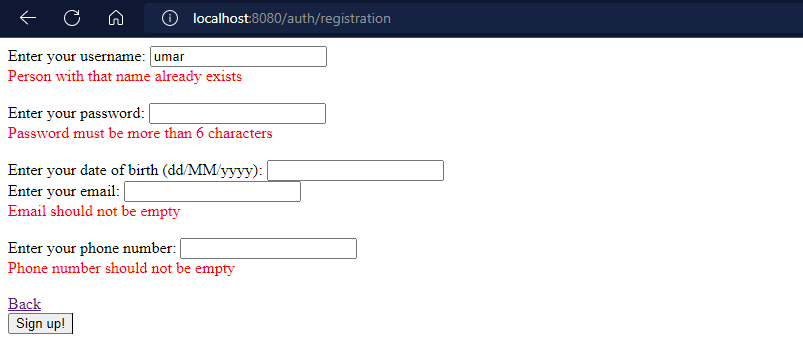
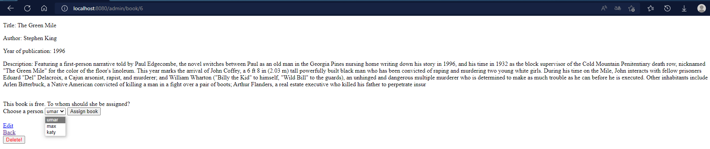
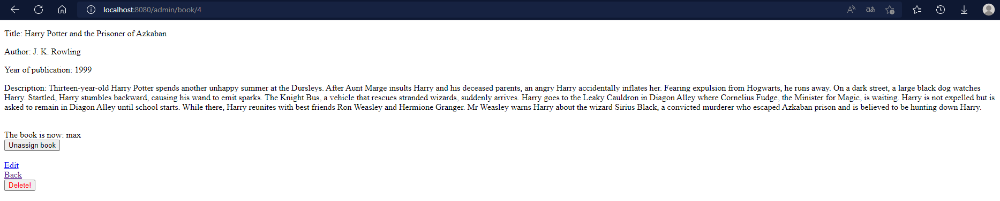
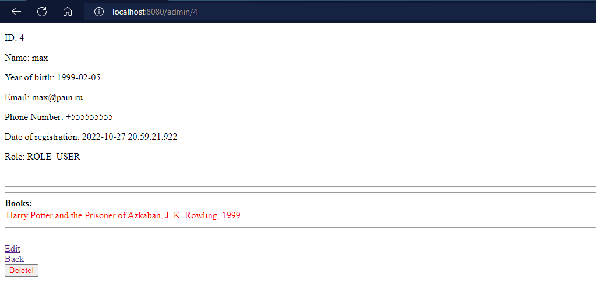
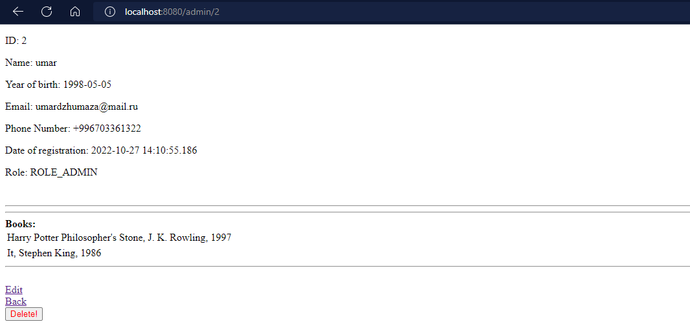
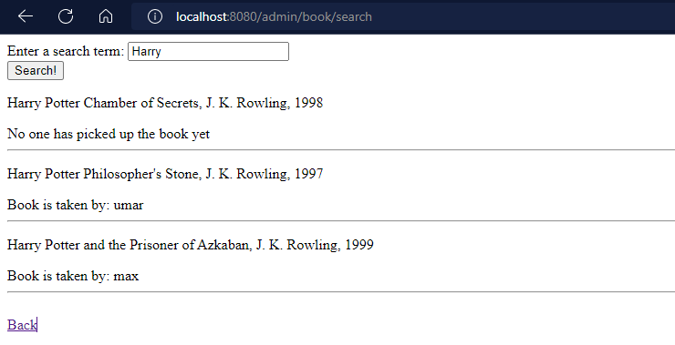

# Book library with Spring Boot, Security, Data Jpa, Hibernate, PostgreSQL, Thymeleaf, Lombok

### User Registration
 
  

### Registration validate

  

### Login error

  

### Edit user(make admin)

  

### All books
 
  

### One book page

  

### Book was taken

  

### The book was taken more than 10 days old(expired), text automatically turns red
 
  

### Book is not expired

  

### Searching books

  

### Pagination param, page=?, Books_per_page=?, sort_by_year=?(true&false)

  
